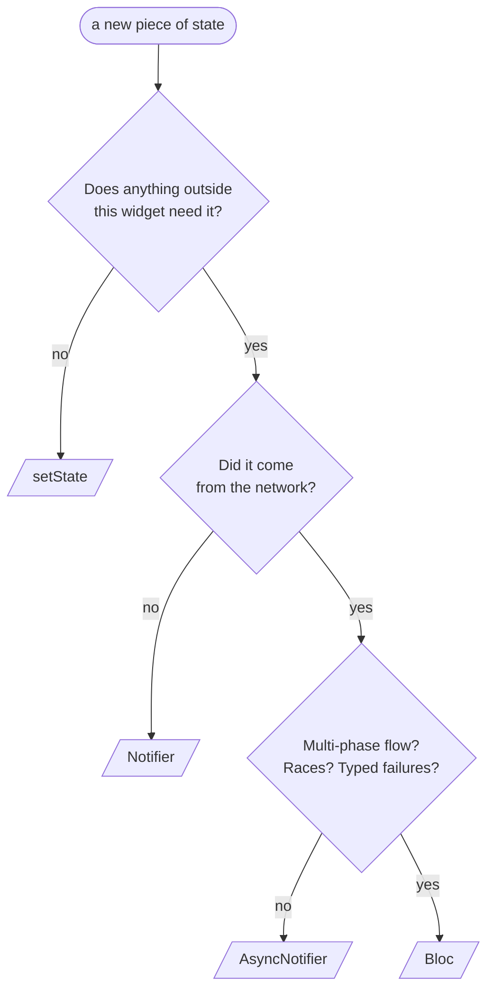
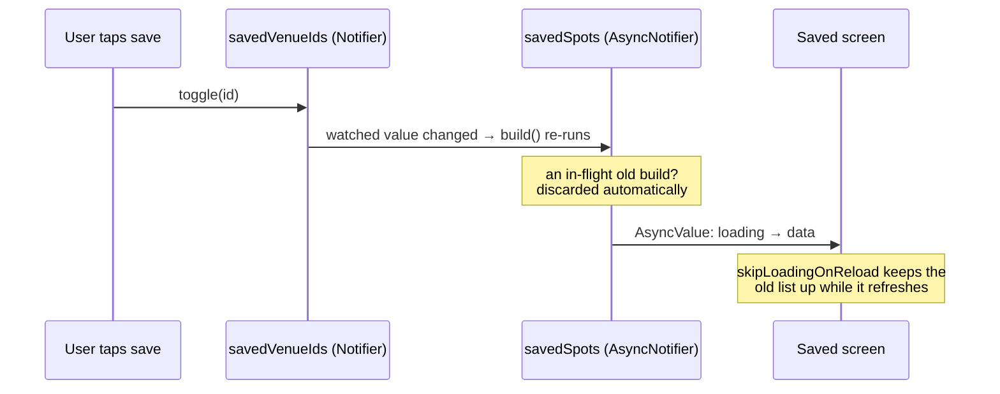
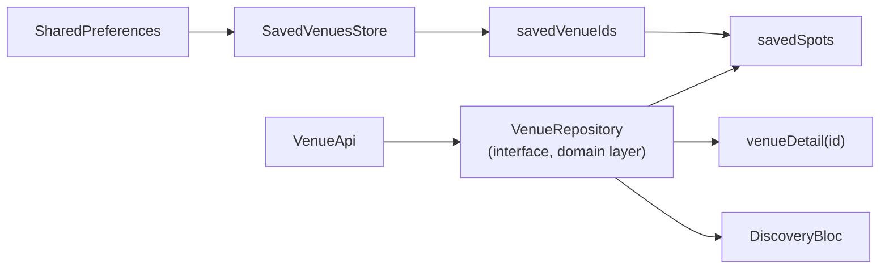
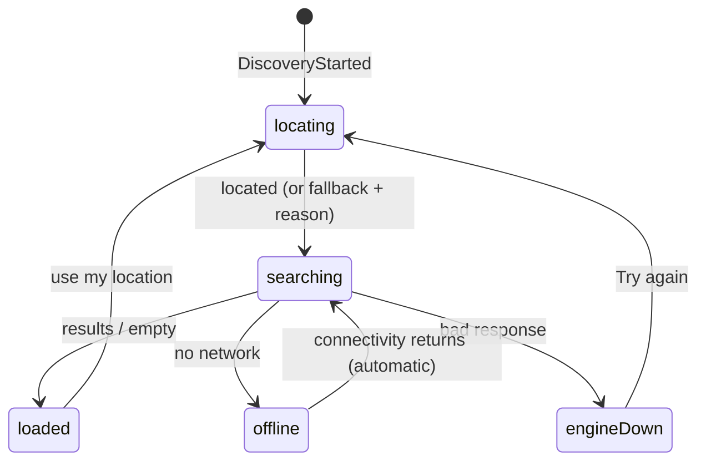

# Flutter State Management, Explained With One Real App

Flutter is the framework I forget fastest. The state management story is
the reason: it gets taught as a package menu (setState! Provider! Riverpod!
Bloc! GetX!) when the real skill is a sorting problem.

> **State comes in four kinds. Each kind has a home. That's the whole
> architecture.**

This repo is BrewDesk, a work-café finder for Android. It uses all four
homes on purpose, so every example below is real code you can open.

| Kind | Example here | Home | React equivalent |
|---|---|---|---|
| Ephemeral | selected tab | `setState` | `useState` |
| Client | search filters | `Notifier` | Zustand |
| Server | saved venues | `AsyncNotifier` | TanStack Query |
| Machine | discovery flow | one Bloc | Redux + RxJS |

When you can't remember anything else, run this:



Now the four kinds, one at a time.

---

## 1 · Ephemeral state: setState, unapologetically

The tab bar (`app_shell.dart`) keeps its index in a `StatefulWidget` and
calls `setState`. No provider, no store. Correct.

The smell test: *would anyone care if this value vanished on navigation?
Does any other widget need it?* Two no's means the state is ephemeral and
belongs in the widget. Hoisting a tab index into a global store is the
Flutter version of putting a text field in Redux.

**Remember:** local state is not technical debt. It's the default, and you
promote out of it only with a reason.

---

## 2 · Client state: a Notifier is a ten-line store

The filter menu (Wi-Fi floor, outlets, venue type, laptop policy, search
query) is state the *user* owns. Three widgets read it; none of them own
it. So it lives in a small store,
`discovery_filters_controller.dart`:

```dart
@riverpod
class DiscoveryFiltersController extends _$DiscoveryFiltersController {
  @override
  DiscoveryFilters build() => const DiscoveryFilters();

  void setMinWifi(WifiLevel? v) => state = state.copyWith(minWifi: v);
  // ...four more one-liners
}
```

Two rules carry all of Riverpod:

**Replace, never mutate.** Every mutator assigns a fresh `copyWith` copy.
Change detection is `old == new`; mutate in place and nothing rebuilds.
Immutable values make the bug unwritable, which beats remembering not to
write it.

**Watch in build, read in callbacks.** `ref.watch` subscribes (the filter
badge repaints on every change). `ref.read` grabs the value once (the
reset button, inside `onPressed`). `riverpod_lint` enforces this like
eslint enforces the rules of hooks.

And one habit: the filtered list is computed at render time,
`filters.apply(venues)`, never stored. Stored derived data is a second
source of truth you now babysit forever.

**Remember:** small stores, immutable values, watch-vs-read. That's 90%
of Riverpod.

---

## 3 · Server state: delete your loading flags

This is where hand-rolled state actually hurts. Here's real code this
repo used to ship (condensed from the deleted `SavedViewModel`):

```dart
// BEFORE — five mechanisms, synchronized by hand
class SavedViewModel extends ChangeNotifier {
  bool _loading = false;
  List<Venue> _venues = [];
  List<String> _failedIds = [];
  int _generation = 0;                       // race guard, hand-rolled

  Future<void> load() async {
    final generation = ++_generation;
    _loading = true; notifyListeners();
    // ...fetch...
    if (generation != _generation) return;   // stale response arrived late
    _venues = venues; _loading = false; notifyListeners();
  }
}
```

Loading flag. Two lists. A listener wired to another notifier (not shown).
A generation counter to survive races. Any two of them can disagree, and
nothing forces the screen to handle errors, so it didn't.

The replacement is one method (`saved_spots.dart`):

```dart
// AFTER — the model does all five jobs
@riverpod
class SavedSpotsController extends _$SavedSpotsController {
  @override
  Future<SavedSpots> build() async {
    final ids = ref.watch(savedVenueIdsProvider);   // the subscription
    final repo = ref.watch(venueRepositoryProvider);
    // hydrate ids → venues, keeping per-id failures visible
  }
}
```

Follow one save through the system and you can see why everything else
became unnecessary:



- The race counter? `build()` re-runs and Riverpod discards the
  superseded future. Deleted, not ported.
- The listener wiring? `ref.watch` *is* the subscription.
- The loading flag? The widget gets one `AsyncValue`, always exactly
  loading *or* error *or* data, and `when()` won't compile with a branch
  missing. The old screen had no error UI because nothing demanded one.
  Now the compiler demands it.

Per-item caching is the same idea with an argument: the venue detail
provider is `build(String venueId)`, one cached instance per venue, and
`autoDispose` evicts it when its screen pops. If you know TanStack:
family is the query key, autoDispose is gcTime.

**Remember:** if you're writing a loading flag by hand, you're rebuilding
`AsyncNotifier` badly.

---

## Interlude · Providers are your DI container

Everything above quietly relied on this. Each service is declared as a
provider next to its class, and the graph wires itself:



The detail that matters: the provider's declared type is the **interface**
(`VenueRepository`, defined in the domain layer), while the HTTP class
stays hidden in the data layer. Dependency inversion in one line, enforced
by the compiler.

Payoff: `main.dart` is ten lines. A fake repository is twenty lines of
plain Dart, because it implements an interface instead of stubbing HTTP.
And `ProviderScope(overrides: [...])` swaps any node for a whole test —
`jest.mock`, but typed.

---

## 4 · The state machine: one flow earns a Bloc

Every session runs the discovery funnel: get a location (the permission
prompt may appear, the user may refuse), search, then land somewhere —
results, empty, offline, or engine-down. Offline must heal itself when
the network returns. The retry button will be mashed. A new "use my
location" tap must cancel the search in flight.

That's not a value in a store. That's a machine:



Bloc's ceremony buys three things here, and only here.

**Illegal states won't compile.** The funnel is a sealed type: exactly one
of `locating / searching / loaded / failed`, each carrying only what that
phase can know. "Loading and errored at once" isn't a bug to catch — it's
a value that can't exist. Failures are types too: `offline` arms the
auto-retry; `engine(message)` waits for a human. Different recovery,
different type.

**Races become one word each.**

```dart
on<DiscoveryStarted>(..., transformer: restartable());  // new intent cancels old — switchMap
on<DiscoveryRetryPressed>(..., transformer: droppable()); // mashing ignored — exhaustMap
```

The old code answered "what if two loads overlap?" with interleaved field
writes. Now each event declares its policy, and the connectivity event
rides the same pipeline as user taps.

**Every transition is observable in one place.** `Bloc.observer`, set once
in `main.dart`, logs every `event, from → to` app-wide into an analytics
stub. A complete funnel trace (who denies location, how often offline
heals) with zero instrumentation in feature code. This is the honest
answer to "why tolerate Bloc": try bolting that onto scattered setState.

One habit to steal regardless: **builders render, listeners act.** The
widget tree is a `BlocBuilder` (pure, may run any number of times); the
map camera flies in a `BlocListener` (once per transition). Snackbars and
navigation always go on the listener side.

**Remember:** Bloc is for machines. One per app is normal. Zero is fine.

---

## The tell

Sorting state by kind shows up in the tests:

- filter logic → pure Dart functions, no fakes at all
- every AsyncNotifier → `ProviderContainer` + a 20-line fake, no widgets
- the Bloc → exact state sequences, writable only because states are
  values with real equality
- one widget test proves loading, error, *and* data all render

**When something is painful to test, it's usually state in the wrong row
of the table.** That heuristic found every bug this refactor fixed.

*Deeper: `docs/adr/0001-state-management.md` (the decision record),
`docs/LEARNING_GUIDE.md` (file-by-file tour + interview Q&A), and
`git log --reverse bbdbe20..27ae087` — the refactor as thirteen readable
commits.*

---

## The app itself

BrewDesk is the Android-first Flutter client for Bamware's researched
work-spot finder: a Google map with a venue shelf, Work Fit scores with
claim-level provenance, search and workability filters, photos,
directions, and accountless on-device saves. Material 3, light and dark.

It consumes `https://venuekit-ashen.vercel.app`. The API contract is
owned by `bamware-venue-engine`; this repo is a hand-declared client
(`lib/features/venues/data/venue_dtos.dart`) and must be updated
alongside any response-shape change.

### Run

```bash
flutter pub get
flutter run    # Google Maps needs android/key.properties (mapsApiKey)
```

### Verify

```bash
flutter analyze
flutter test
flutter build apk --debug
```

### Release and store

Uploads and the Play listing ship via fastlane
(`fastlane android internal|listing`), with all submission content under
`submission/`. See `submission/README.md`.

### Notes

- `assets/venue_snapshot.json` bundles the top 50 NYC venues; refresh it
  with `scripts/refresh-venue-snapshot.sh`. The cold-start path that
  consumes it is currently unwired pending a product decision (#37).
- The launcher icon and Play graphics are generated; run
  `fastlane android assets` after any brand change.
- Visual direction: `docs/design/BrewDeskDesignSpecv1.pdf`.
